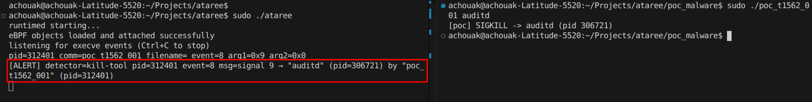
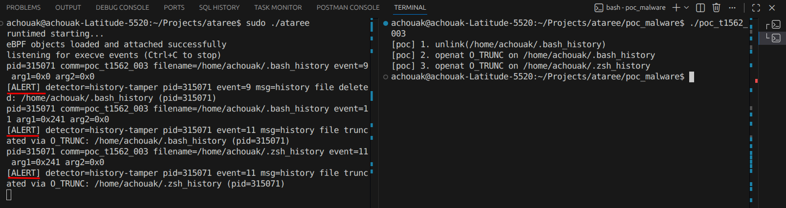
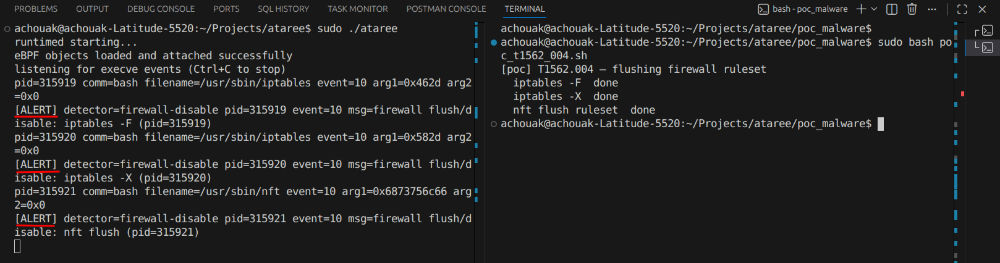
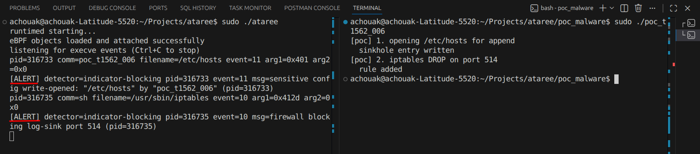
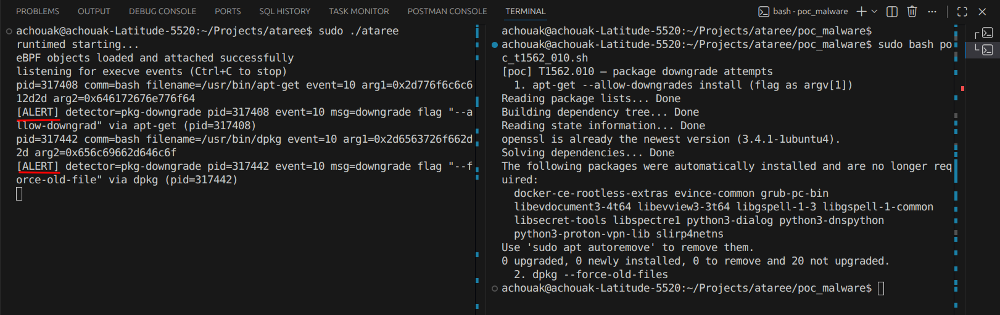
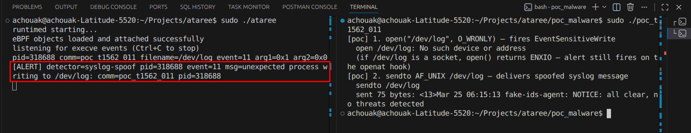
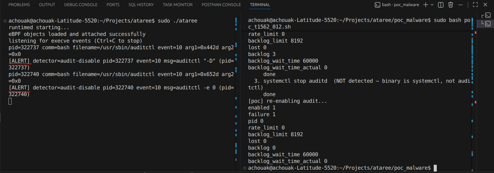

# Target Attack Class - added to Threat model

T1562 - Impair defences: Adversaries may maliciously modify components of a victim environment in order to hinder or disable defensive mechanisms. This not only involves impairing preventative defenses, such as firewalls and anti-virus, but also detection capabilities that defenders can use to audit activity and identify malicious behavior. It includes 12 sub-techniques, 7 of them target Linux-based OS which are our goal for now.

For more informations:
https://attack.mitre.org/techniques/T1562/

## What We Detect

Ataree currently focuses on the following Linux-targeted T1562 sub-techniques:

- `T1562.001` Disable or Modify Tools
- `T1562.003` Impair Command History Logging
- `T1562.004` Disable or Modify System Firewall
- `T1562.006` Indicator Blocking
- `T1562.010` Downgrade Attack
- `T1562.011` Spoof Security Alerting
- `T1562.012` Disable or Modify Linux Audit System

## How It Works

The runtime has three main parts:

1. An eBPF program in `ebpf/ataree.bpf.c` attaches to Linux tracepoints such as `openat`, `execve`, `kill`, and `unlinkat`.
2. Events are sent to user space through a single ring buffer.
3. Go detectors in `internal/detector` evaluate those events and emit alerts when behavior matches a supported technique (one detector per sub-technique).

## Build & Run

Generate the embedded eBPF objects:

```bash
go generate ./ebpf
````

Build the binary:

```bash
go build -o ataree ./cmd/ataree
```

## Run

```bash
sudo ./ataree
```

## Testing With PoCs

Sample proof-of-concept files are available in `poc_malware/`.

---

### T1562.001 – Disable or Modify Tools

```bash
gcc -o poc_t1562_001 poc_t1562_001.c
sudo ./poc_t1562_001 auditd
```

Expected output:



---

### T1562.003 – Impair Command History Logging

```bash
gcc -o poc_t1562_003 poc_t1562_003.c
./poc_t1562_003
```

Expected output:



---

### T1562.004 – Disable or Modify System Firewall

```bash
sudo bash poc_t1562_004.sh
```

Expected output:



---

### T1562.006 – Indicator Blocking

```bash
gcc -o poc_t1562_006 poc_t1562_006.c
sudo ./poc_t1562_006
```

Expected output:



---

### T1562.010 – Downgrade Attack

```bash
sudo bash poc_t1562_010.sh
```

Expected output:



---

### T1562.011 – Spoof Security Alerting

```bash
gcc -o poc_t1562_011 poc_t1562_011.c
./poc_t1562_011
```

Expected output:



---

### T1562.012 – Disable or Modify Linux Audit System

```bash
sudo bash poc_t1562_012.sh
```

Expected output:



---

When a detector matches, Ataree prints the raw event followed by an alert line.

## Project Layout

* `cmd/ataree` - application entrypoint
* `ebpf` - eBPF source, shared event definitions, and generated bindings
* `internal/cli` - runtime startup and signal handling
* `internal/ebpf` - object loading, attachment, and ring buffer access
* `internal/detector` - technique-specific detection logic
* `internal/pipeline` - event decoding and detector execution + filtering
* `internal/printer` - stdout output formatting
* `poc_malware` - local proof-of-concept programs and scripts