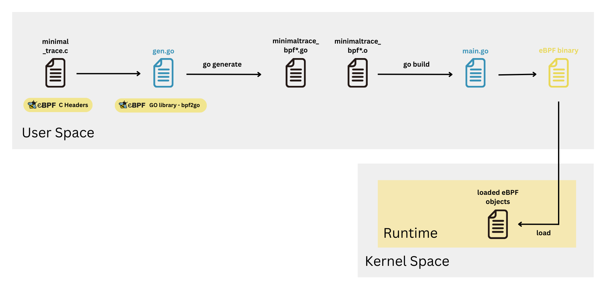

# Ataree

**Ataree** is a Linux runtime security project built using eBPF.

It observes kernel activity in real time and streams structured events
to user space for inspection, filtering, and analysis.

## Goals

- Learn eBPF deeply
- Build a clean Go runtime architecture
- Avoid over-engineering
- Be understandable and hackable

!!! tip
    This documentation will be hand written.
    No AI slop, only when necessary.

## Getting Started
### Dependencies
The go.mod and go.sum files define all needed dependencies and used tools needed for this project, similar to how requirements.txt worksin regular projects.

### Compiling eBPF program to .o
`bpf2go` go library is used for that, gen.go file takes care of compiling eBPF and producing `.o` kernel objects and their corresponding Go source files, this generation is done by running `go generate` inside `./bpf`.

P.S: All generated `.o` and `.go` files are checked into source control, so there is no need to regenerate them unless changes to the `.c` files are made.

#### Generation Notes
Depending on the environment, here are few notes from the go documentation that might help if any problems are faced:

- For Debian/Ubuntu, you'll typically need libbpf-dev. On Fedora, it's libbpf-devel.

- On AMD64 Debian/Ubuntu, install linux-headers-amd64. On Fedora, install kernel-devel.

- On Debian, you may also need ln -sf /usr/include/asm-generic/ /usr/include/asm since the example expects to find <asm/types.h>

### Loading eBPF objects
The `main.go` file takes care of the loading process, using the predefined generated functions inside the previously generated `.go` files.

Run `go build` inside the root project directory to generate the ataree binary.

Now the eBPF programs should be run as root (or have CAP_BPF), so what is left to do is to run: `sudo ./ataree`.

### Current Pipeline

### References
- https://ebpf-go.dev/guides/getting-started/
- https://ebpf.io/what-is-ebpf/#introduction-to-ebpf
